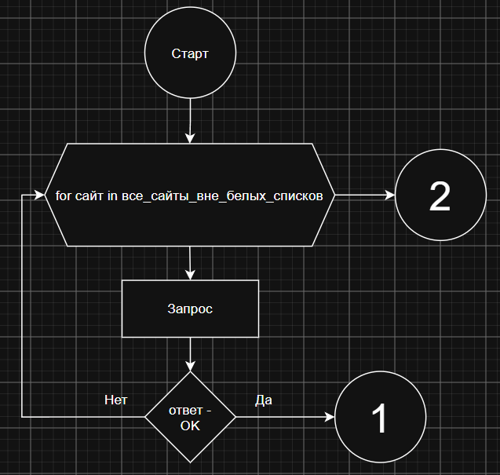
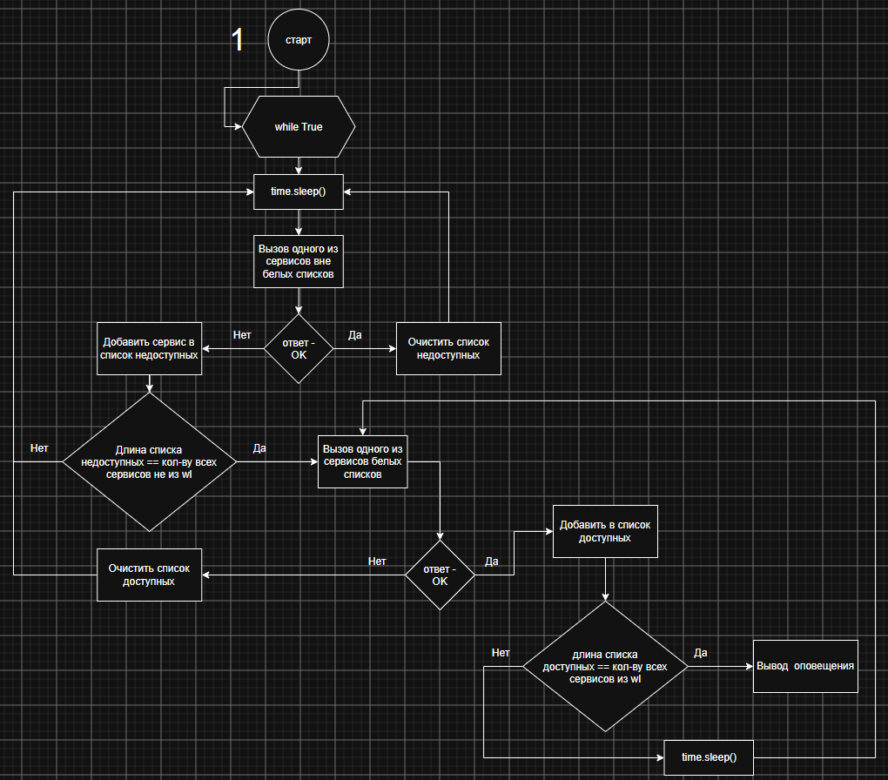
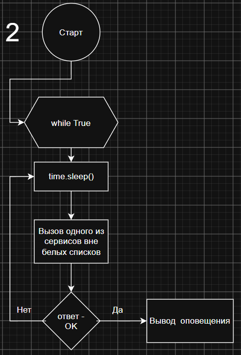

# whitelist_notify

Системные оповещения относительно введения или снятия белых списков для windows.

---

Мониторим введение белых списков:

Мониторим доступ к свободному интернету:

*Python 3.11*

Скачать [exe](https://github.com/filthps/whitelist_notify/releases/) из <code>RAR</code>

или

1) create venv
2) <code>pip install -r requirements.txt</code>
3) <code> pyinstaller base/ui.py base/*.py --add-data "base/db.json:base/db.json" --add-data "base/images/tray.png:base/images/tray.png" --add-data "base/images/wl-off.png:base/images/wl-off.png" --add-data  "base/images/wl-on.png:base/images/wl-on.png"  --onefile --noconsole </code>
4) Папку images с содержимым копировать в папку dist
В полученной папке dist появится <code>ui.exe</code> для запуска.
